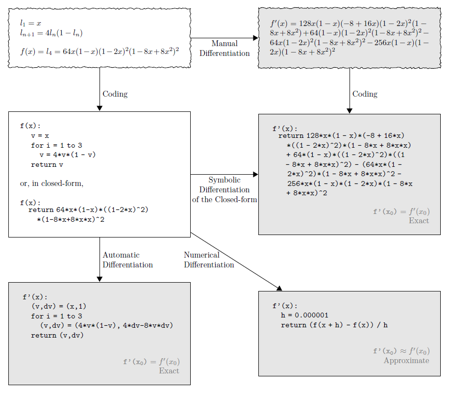

Automatic Differentiation
=========================

Different Ways to Calculate Derivatives [1]_
-------------------------------

Normally it is considered that there are 4 ways to calculate derivatives, manual differentiation, numerical differentiation, symbolic differentiation, and automatic differentiation. An example is shown in the following figure:

   demonstration of different ways to calculate derivatives [1]_

To summarize:

- Manual
    - Time consuming and prone to error
    - Requires closed-form expressions
- Numerical differentiation (finite difference)
    - Can be highly inaccurate due to round-off and truncation errors
    - Scales poorly for gradients: :math:`O(n)` evaluations of :math:`f` for a gradient in :math:`n` dimensions
    - scipy.optimize: jacobian: 2-point, 3-point
- Symbolic differentiation
    - Results in complex and cryptic expressions plagued with the problem of **“expression swell”**
    - Requires closed-form expressions
- Automatic differentiation
    - Apply symbolic differentiation at the elementary operation level and keep intermediate numerical results
    - Accurate evaluation of derivatives at **machine precision**
    - **Support control flows** such as branching, loops, recursion, and procedure calls

Forward Mode v.s. Backward Mode
-------------------------------

In general there are two ways to perform automatic differentiation, the forward mode and the backward mode. Consider :math:`f: \mathcal{R}^n \rightarrow \mathcal{R}^m`, :math:`y=f(x)`.

+---------------------------------------------------+--------------------------------------------------+
|  Forward Mode / Tangent Mode                      |  Backward Mode / Adjoint Mode                    |
+===================================================+==================================================+
|  :math:`\dot{v}_i=\frac{\partial v_i}{\partial x}`| :math:`\bar{v}_i=\frac{\partial y}{\partial v_i}`|
+---------------------------------------------------+--------------------------------------------------+
|                                                   |                                                  |
+---------------------------------------------------+--------------------------------------------------+
|   constant memory requirements                    | cost of increased memory requirements            |
+---------------------------------------------------+--------------------------------------------------+
|                                                   |                                                  |
+---------------------------------------------------+--------------------------------------------------+
|                                                   |                                                  |
+---------------------------------------------------+--------------------------------------------------+

Implementation
--------------

References

.. [1] Baydin, Atilim Gunes, et al. "Automatic differentiation in machine learning: a survey." Journal of Marchine Learning Research 18 (2018): 1-43.
.. [2] Margossian, Charles C. "A review of automatic differentiation and its efficient implementation." Wiley interdisciplinary reviews: data mining and knowledge discovery 9.4 (2019): e1305.
.. [3] Van Merriënboer, Bart, et al. "Automatic differentiation in ML: Where we are and where we should be going." Advances in neural information processing systems 31 (2018).
.. [4] Van Merriënboer, Bart, Alexander B. Wiltschko, and Dan Moldovan. "Tangent: Automatic differentiation using source code transformation in Python." arXiv preprint arXiv:1711.02712 (2017).
.. [5] Innes, Michael. "Don't unroll adjoint: Differentiating ssa-form programs." arXiv preprint arXiv:1810.07951 (2018).
.. [6] Innes, Mike, et al. "A differentiable programming system to bridge machine learning and scientific computing." arXiv preprint arXiv:1907.07587 (2019).
.. [7] Hu, Yuanming, et al. "Difftaichi: Differentiable programming for physical simulation." arXiv preprint arXiv:1910.00935 (2019).
